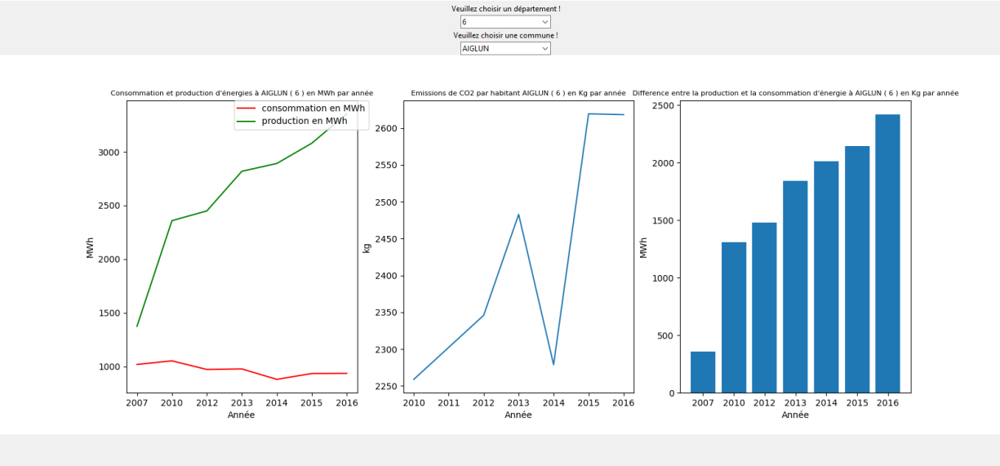

# ID_Project
A Wrapper-Mediator application that treats production , consumption and gaz emission in France (PACA region) from 2007 to 2016.
# Rendu
## Description des sources de données : 

### Première source : 
Le jeu de données "Production d'énergie par commune en Provence Alpes Côte d'Azur - Indicateur" fournit les indicateurs de production d'énergie primaire par commune de 2007 à 2016. Les données sont extraites de l'application CIGALE : http://cigale.atmosud.org/.

L'énergie primaire représente l'ensemble des produits énergétiques avant transformation. La production d'énergie primaire comprend l'extraction de combustibles fossiles (pétrole brut, gaz naturel, combustibles minéraux solides, etc.), la production d'énergie nucléaire (chaleur générée par la fission des atomes) ainsi que la production d'énergie renouvelable (énergie solaire thermique, photovoltaïque, hydraulique, éolienne, géothermique, biomasse, etc.).

### Deuxième source : 
Le jeu de données "Consommation d'énergie finale par commune en Provence Alpes Côte d'Azur - 2007 - 2016 - Indicateur" est extrait de l'outil CIGALE : http://cigale.atmosud.org/.

La consommation d'énergie finale représente l'ensemble de l'énergie consommée par les utilisateurs finaux, incluant les consommations d'électricité et de chaleur (qui sont des énergies secondaires), mais excluant les consommations énergétiques du secteur de la production/transformation d'énergie (considérées comme de l'énergie primaire). Les émissions de gaz à effet de serre résultantes intègrent donc les émissions indirectes de CO2 liées à la consommation d'électricité (SCOPE 1 et 2).

### Troisième source : 
Indicateur des émissions de gaz à effet de serre PRG100 par commune, de 2007 à 2016, extrait de l'application CIGALE : http://cigale.atmosud.org/

Le Pouvoir de Réchauffement Global (PRG) est un indicateur utilisé pour mesurer l'impact de chaque gaz à effet de serre sur le réchauffement global, sur une période donnée, généralement 100 ans. Il est calculé à partir des PRG de chaque substance et est exprimé en équivalent CO2 (CO2e).

Le PRG du CO2 est toujours égal à 1 par définition. Les coefficients utilisés dans l'inventaire sont ceux établis lors de la Conférence des Parties de 1995 et appliqués dans le cadre du protocole de Kyoto (CO2=1, CH4=21, N2O=310). Les gaz fluorés ne sont actuellement pas inclus dans l'inventaire.

### Quatrièmee source :  
Le jeu de données "pop_historique.xls" contient les chiffres de la population par commune de la Région Provence-Alpes-Côte d'Azur entre 2009 et 2016. Les données sont extraites de l'INSEE, RP Populations légales et sont disponibles sur "Notre Territoire", une plateforme interactive de cartographie statistique exploitée par la Région Provence-Alpes-Côte d'Azur.

Le fichier "pop_historique.xls" comprend des indicateurs tels que la superficie de la population municipale (2016 - 2009), l'indice de jeunesse de la population en 2015, la densité moyenne de la population en 2016 et l'indice de vieillissement de la population en 2015. Chaque indicateur est détaillé dans une feuille de calcul du fichier, avec un onglet dédié.

Les données de chaque onglet sont disponibles sur l'application Notre Territoire et peuvent être consultées via l'aperçu ou par API. Cette plateforme fournit plus de 3000 indicateurs pour comprendre les dynamiques territoriales et permet de personnaliser ses propres cartes. Elle est destinée aux partenaires de l'institution et au grand public pour la connaissance du territoire.

## Description du scénario applicatif:
L'application est une plateforme pour gérer et suivre la consommation et la production d'énergie et les émissions des gazs au niveau local, spécifiquement dans la région Provence-Alpes-Côte d'Azur.

La première source de données, "Production d'énergie par commune en Provence-Alpes-Côte d'Azur", est utilisée pour recueillir des informations sur la production d'énergie de chaque commune de la région. Ces données pourraient être utilisées pour cartographier la production d'énergie de chaque région et mettre en évidence les communes qui produisent le plus d'énergie et les types d'énergie qu'elles produisent.

La deuxième source de données, "Consommation d'énergie par commune en Provence-Alpes-Côte d'Azur de 2007 à 2015", est utilisée pour recueillir des informations sur la consommation d'énergie de chaque commune de la région. Ces données pourraient être utilisées pour identifier les zones à forte consommation d'énergie et pour aider à élaborer des politiques visant à réduire la consommation d'énergie dans ces zones.

La troisième source de données, "Émissions de gaz à effet de serre par commune", est utilisée pour recueillir des informations sur les émissions de gaz à effet de serre de chaque commune de la région. Ces données pourraient être utilisées pour cartographier les émissions de chaque région et mettre en évidence les communes ayant les émissions les plus élevées.

Enfin , la quatrième source est utilisée pour collecter des information concernant l'aspect demographique de la région PACA , elle est utilséé pour mettre en evidence le role de la population de chaque commune dans les émissions de gaz .

Le wrapper médiateur décentralisé  fournit une interface conviviale pour que les particuliers, les communautés et les décideurs puissent accéder à ces informations et les comprendre. Ainsi, la plateforme fournirait une source d'informations sur la consommation, la production et les émissions d'énergie dans la région Provence-Alpes-Côte d'Azur.

# Appercu de l'application : 
- 

## DEV TEAM: 
- FELLOUSSI Idriss 
- MOUZNI Lamara 
- SMAIL Aghilas 

# Credits : AtmoSud
 All rights reserved 

